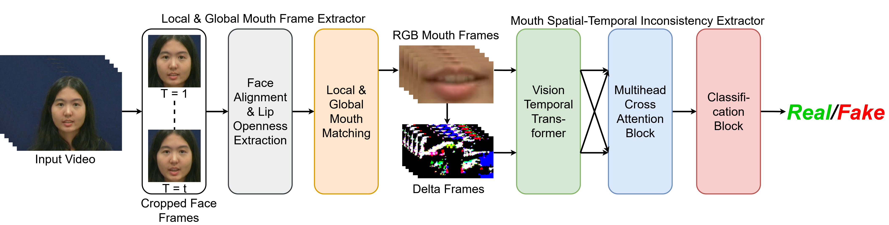

# Detecting Lip-Syncing Deepfakes: Vision Temporal Transformer for Analyzing Mouth Inconsistencies 
Soumyya Kanti Datta, Shan Jia, Siwei Lyu


## Abstract
Deepfakes are AI-generated media in which the original content is digitally altered to create convincing but manipulated images, videos, or audio. Among the various types of deepfakes, lip-syncing deepfakes are one of the most challenging deepfakes to detect. In these videos, a person's lip movements are synthesized to match altered or entirely new audio using AI models. Therefore, unlike other types of deepfakes, the artifacts in lip-syncing deepfakes are confined to the mouth region, making them more subtle and, thus harder to discern. In this paper, we introduce a novel approach utilizing a combination of Vision Temporal Transformer with multihead cross-attention to detect lip-syncing deepfakes by identifying spatiotemporal inconsistencies in the mouth region. These inconsistencies appear across adjacent frames and persist throughout the video. Our model can successfully capture these subtle spatiotemporal irregularities, achieving state-of-the-art performance on several benchmark deepfake datasets. Additionally, we created a new lip-syncing deepfake dataset, LipSyncTIMIT, which was generated using five state-of-the-art lip-syncing models.




# LipSyncTimit Dataset : A Multimodal Dataset for LipSyncing DeepFake Forensics

LipSyncTimit Dataset includes 202 real videos from the VidTIMIT dataset, which contains recordings of 43 volunteers reciting short sentences, with synchronized audio and visual tracks. We collected real audio samples from the LSR2 dataset, and AI-generated (fake) audio samples were obtained from the LibriSeVoc dataset.


# Prerequisites
- `Python 3.10` 
- Install necessary packages using `pip install -r requirements.txt`.
- Download the dlib’s pre-trained facial landmark detector from [here](https://drive.google.com/file/d/1-Uc2rH1tiKZEh9NwmgmBFZT_6xDvGBSD/view?usp=sharing) and put it in the same folder as demo.py.
- The input video should have the face of **only 1 subject** in the entire video.
- The input video should have **1 face per frame**.

# Inference: Lip-syncing videos detection using the pre-trained models 

The input_video should be in mp4 format :
```
python demo.py --input_path {input_video_path} --output_path {output_path}
```
The demo video is saved (by default) as `{input_video_name}_demo.mp4`.


# Citation
Please cite our paper in your publications if you use our LIPINC-V2 Detection model or our LipSyncTimit dataset in your research:
```
@article{datta2025Detecting,
  title={Detecting Lip-Syncing Deepfakes: Vision Temporal Transformer for Analyzing Mouth Inconsistencies},
  author={Datta, Soumyya Kanti and Jia, Shan and Lyu, Siwei},
  year={2025}
}
```


